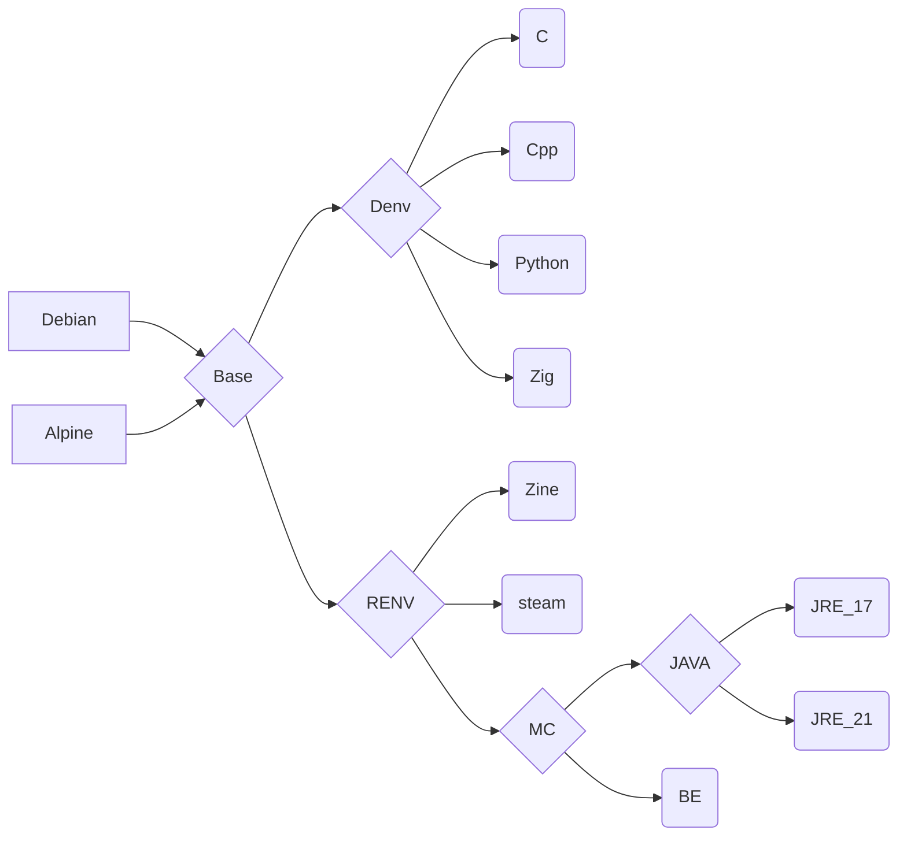

# Cenv

**ghcr.io: https://github.com/eoeair/cenv/pkgs/container/cenv**

## Platform
* OS : 
    * debian 13
    * alpine latest
* ARCH : x86_64

## Usage
### container
* just `docker run -it`
### devcontainer(VScode)
`cp -r .devcontainer WORKSDIR`

## Image dependencies
* `Denv` : development environment
* `Renv`: runtime environment

## Mirror source
* debian ustc：https://mirrors.ustc.edu.cn/help/debian.html