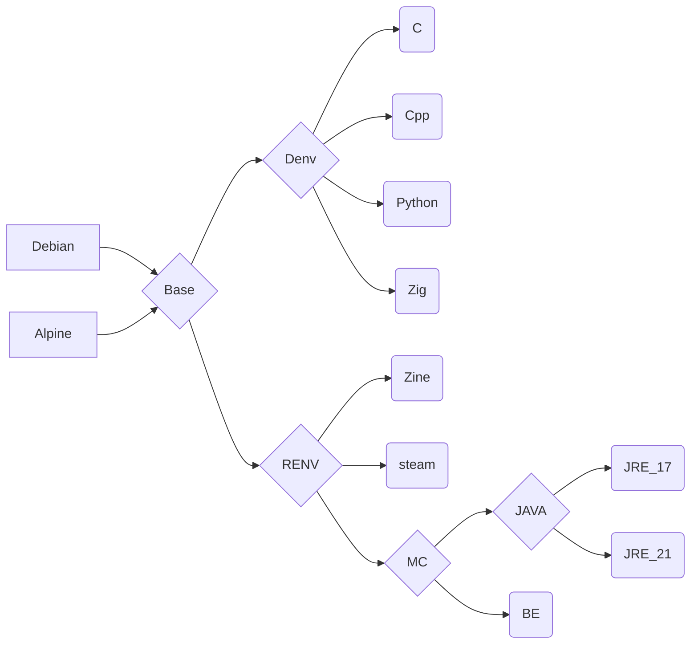

# Cenv

**ghcr.io: https://github.com/eoeair/cenv/pkgs/container/cenv**

## Platform
* OS : 
    * debian 13
    * alpine latest
* ARCH : x86_64

## Container Usage
1. oci: `docker run -it`
2. devcontainer(VScode): `cp -r .devcontainer WORKDIR`

## Note
1. C/C++ environment: `.vscode` config may not be loaded on the first run. Please `Reload Window` to ensure the configuration is loaded.
    1. Press Ctrl + Shift + P (Windows/Linux) or Cmd + Shift + P (macOS) to open the Command Palette.
    2. Type `Reload Window` in the search bar.
    3. Select the `Reload Window` command.

## Image dependencies
* `Denv` : development environment
* `Renv`: runtime environment

## Mirror source
* debian ustc：https://mirrors.ustc.edu.cn/help/debian.html