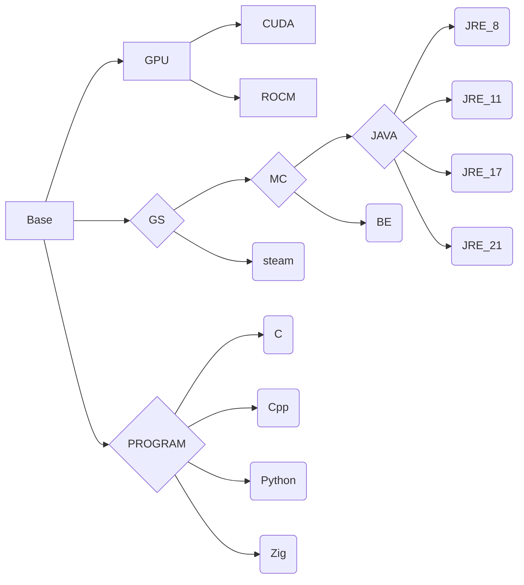

# Cenv

**ghcr.io: https://github.com/eoeair/cenv/pkgs/container/cenv**

## Prerequisites
* CPU : nothing to do
* ROCM : amdgpu-dkms -> Docker containers share the kernel with the host OS. Therefore, the ROCm kernel-mode driver (amdgpu-dkms) must be installed on the host.
* CUDA : nvidia-container-toolkit/nvidia-docker2

## Platform
* OS : debian 12
* ARCH : x86_64

## Version
* cuda: 12.4
* rocm: 6.3

## Usage
### container
* CPU just `docker run -it`
* ROCM `docker run --device /dev/kfd --device /dev/dri --security-opt seccomp=unconfined IMAGE`
### devcontainer(VScode)
`cp -r .devcontainer WORKSDIR`

## Image dependencies
* `Program` : development environment, primarily serving the devcontainer.
* `GS` : game server

## Upstream
* NVIDIA: https://gitlab.com/nvidia/container-images/cuda
* ROCM: https://github.com/ROCm/ROCm-docker

## Mirror source
* debian ustc：https://mirrors.ustc.edu.cn/help/debian.html
* ubuntu ustc：https://mirrors.ustc.edu.cn/help/ubuntu.html