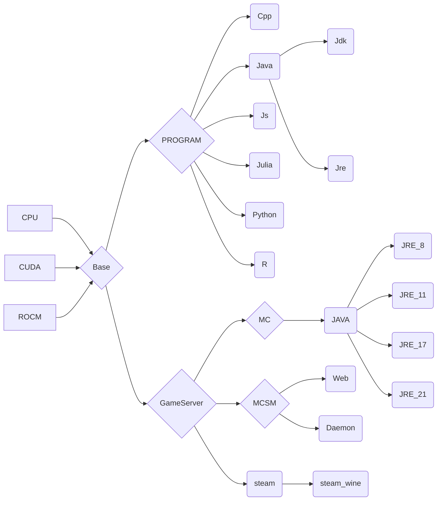

# Cenv
English | [中文](README_CN.md)

**THIS doc for non-CN USER**

**dockerhub: https://hub.docker.com/r/ben0i0d/cenv**

**Our Gitea: https://eoelab.org:1027/ben0i0d/cenv**

## Prerequisites
* CPU : nothing to do
* ROCM : amdgpu-dkms -> Docker containers share the kernel with the host OS. Therefore, the ROCm kernel-mode driver (amdgpu-dkms) must be installed on the host.
* CUDA : nvidia-container-toolkit/nvidia-docker2

## Platform
* OS : debian 12 / ubuntu 24.04(ROCM only)
* ARCH : x86_64

## Version
* cuda: 12.4
* rocm: 6.2.4

## Usage
### container
* CPU just `docker run -it`
* ROCM `docker run --device /dev/kfd --device /dev/dri --security-opt seccomp=unconfined IMAGE`
### devcontainer(VScode)
`cp -r .devcontainer WORKSDIR`

## Image dependencies

## Upstream
* NVIDIA: https://gitlab.com/nvidia/container-images/cuda
* ROCM: https://github.com/ROCm/ROCm-docker

## Mirror source
* debian ustc：https://mirrors.ustc.edu.cn/help/debian.html
* ubuntu ustc：https://mirrors.ustc.edu.cn/help/ubuntu.html