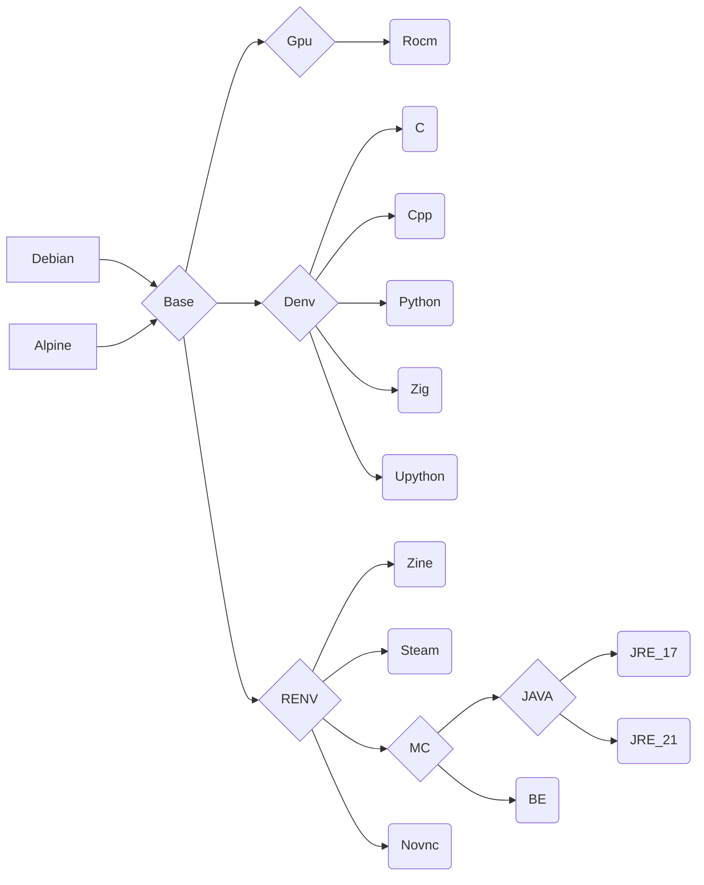

# Cenv

**ghcr.io: ghcr.io/eoeair/cenv:TAG**

## Platform
* OS: 
    * debian 13
    * alpine latest
* ARCH: x86_64
* ROCM: 6.3.4
## Container Usage
1. oci: `docker run -it`
2. devcontainer(VScode): `cp -r .devcontainer WORKDIR`

## Note
1. Denv: `git` may not be loaded on the first run. Please `Reload Window`.
    1. Press Ctrl + Shift + P (Windows/Linux) or Cmd + Shift + P (macOS) to open the Command Palette.
    2. Type `Reload Window` in the search bar.
    3. Select the `Reload Window` command.
2. C/C++ environment: `.vscode` config may not be loaded on the first run. Please `Reload Window` to ensure the configuration is loaded.
3. upython(micropython): 
    1. run `sudo usermod -aG dialout $USER` before use container, add youself to `dialout`
    2. hardware -> tty:
        * raspberry pico: `/dev/ttyACM0`
        * raspberry pi: `/dev/ttyUSB0`
    3. stub(support pylance): `pip install micropython-XXX-stubs`, search on `pypi.org`.
4. rocm: 
    1. run `sudo apt install rocminfo`
    2. run `sudo usermod -aG video,render $USER` before use container, add youself to `video`,`render`
    3. not include any package, please install what you want
    4. how to build jax wheels: this step no need availble gpu, you can run on cpu_only runner
        1. apt install git clang patchelf rocm
        2. git clone https://github.com/ROCm/rocm-jax.git
        3. cd rocm-jax/jax_rocm_plugin
        4. python3 build/build.py build --wheels=jax-rocm-plugin,jax-rocm-pjrt --rocm_version=6 --rocm_path=/opt/rocm-6.4.3
    5. how to run jax: jax support 0.6.x(0.6.2 is tested)
        1. apt install rocm-llvm rccl hipsolver hipfft miopen-hip libamd-comgr2 
        2. pip install jax==0.6.2
        3. pip install ./jax_rocm6_pjrt-0.6.0.dev20250909-py3-none-manylinux2014_x86_64.whl
        4. pip install ./jax_rocm6_plugin-0.6.0.dev20250909-cp311-cp311-manylinux2014_x86_64.whl
## Image dependencies
* `Denv` : development environment
* `Renv`: runtime environment
* `Gpu`: gpu environment

## Mirror source
* debian ustc：https://mirrors.ustc.edu.cn/help/debian.html