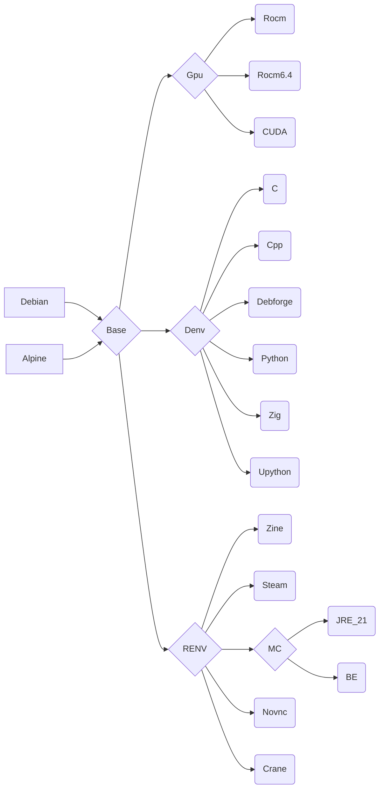

# Cenv

**ghcr.io: ghcr.io/eoeair/cenv:TAG**

## Platform
* ARCH: x86_64
* OS: 
    * debian testing & 12 (only support GPU)
    * alpine edge
* ROCM: 7.0.1
* CUDA: >= 12.3
## Container Usage
1. oci: `docker run -it`, See the `runArgs` section of the devcontainer config file for more options.
2. devcontainer(VScode): `cp -r .devcontainer WORKDIR`

## Note
1. Denv: `git` may not be loaded on the first run. Please `Reload Window`.
    1. Press Ctrl + Shift + P (Windows/Linux) or Cmd + Shift + P (macOS) to open the Command Palette.
    2. Type `Reload Window` in the search bar.
    3. Select the `Reload Window` command.
2. C/C++ environment: `.vscode` config may not be loaded on the first run. Please `Reload Window` to ensure the configuration is loaded.
    1. if you need source, please run `sed -i 's/Types: deb/Types: deb deb-src/' /etc/apt/sources.list.d/debian.sources`
3. upython(micropython): 
    1. run `sudo usermod -aG dialout $USER` before use container, add youself to `dialout`
    2. hardware -> tty:
        * raspberry pico: `/dev/ttyACM0`
        * raspberry pi: `/dev/ttyUSB0`
    3. stub(support pylance): `pip install micropython-XXX-stubs`, search on `pypi.org`.
4. cuda:
    1. **Make sure you have installed the [NVIDIA driver](https://docs.nvidia.com/datacenter/cloud-native/container-toolkit/install-guide.html#nvidia-drivers) for your Linux Distribution**
    2. **Note that you do not need to install the CUDA Toolkit on the host system, but the NVIDIA driver needs to be installed**
    3. For instructions on getting started with the NVIDIA Container Toolkit, refer to the [installation guide](https://docs.nvidia.com/datacenter/cloud-native/container-toolkit/install-guide.html#installation-guide)
    4. for china,maybe need a mirror site: run `sed -i 's/developer.download.nvidia.com/developer.download.nvidia.cn/g' /etc/apt/sources.list.d/cuda-debian12-x86_64.list`
5. rocm: 
    1. run `sudo apt install rocminfo`
    2. run `sudo usermod -aG video,render $USER` before use container, add youself to `video`,`render`
    3. not include any package, please install what you want(`apt install rocm`)
    4. how to run jax: jax support 0.6.0
        1. apt install hipsolver hipfft miopen-hip rccl rocm-llvm rocprofiler-sdk hsa-amd-aqlprofile libamd-comgr2 libdw1  (***I just want to minimize runtime; you can absolutely do a full ROCm installation.***)
        2. pip install jax==0.6.0
        3. pip install https://github.com/ROCm/rocm-jax/releases/download/rocm-jax-v0.6.0/jaxlib-0.6.0-cp311-cp311-manylinux2014_x86_64.whl
        4. pip install https://github.com/ROCm/rocm-jax/releases/download/rocm-jax-v0.6.0/jax_rocm7_pjrt-0.6.0-py3-none-manylinux_2_28_x86_64.whl https://github.com/ROCm/rocm-jax/releases/download/rocm-jax-v0.6.0/jax_rocm7_plugin-0.6.0-cp311-cp311-manylinux_2_28_x86_64.whl
    5. for china,maybe need a mirror site:
        1. run `sed -i 's/repo.radeon.com/radeon.geekery.cn/g' /etc/apt/sources.list.d/amdgpu.list`
        2. run `sed -i 's/repo.radeon.com/radeon.geekery.cn/g' /etc/apt/sources.list.d/rocm.list`
    6. how to run pytorch: only support rocm6.4
        1. run `pip install torch torchvision --index-url https://download.pytorch.org/whl/rocm6.4`
        2. PyTorch currently only supports ROCm 6.4. Please do not use the default `cenv:rocm`; instead, use `cenv:rocm6.4`.
        3. for china,maybe need a mirror site:
            1. run `pip install torch torchvision torchaudio --no-deps -f https://mirrors.aliyun.com/pytorch-wheels/rocm6.4/`
            2. run `pip install numpy pillow filelock fsspec jinja2 networkx sympy pytorch-triton-rocm -f https://mirrors.aliyun.com/pytorch-wheels/` (When installing PyTorch from the ROCm wheel mirror, you will need to manually install some dependencies.)
## Image dependencies
* `Denv` : development environment
* `Renv`: runtime environment
* `Gpu`: gpu environment

## Mirror source
* debian ustc：https://mirrors.ustc.edu.cn/help/debian.html