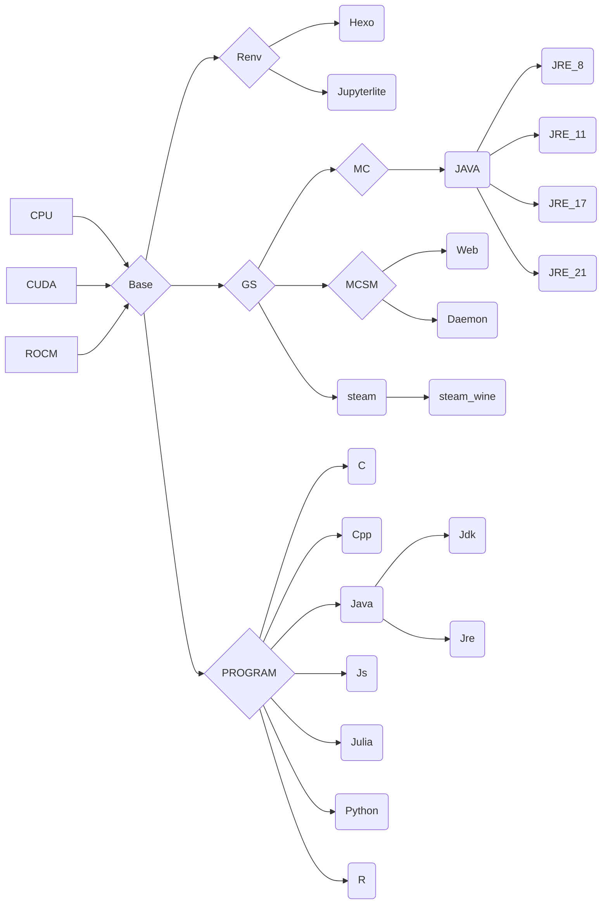

# gpu
English | [中文](README_CN.md)

**为中国用户的文档**

**ghcr.io: https://github.com/eoeair/cenv/pkgs/container/cenv**

**Our Gitea: https://eoelab.org:1027/eoeair/cenv**

## 先决条件
* CPU : nothing to do
* ROCM : amdgpu-dkms -> Docker 容器与主机操作系统共享内核。因此，主机上必须安装 ROCm 内核模式驱动程序 ( amdgpu-dkms )
* CUDA : nvidia-container-toolkit/nvidia-docker2

## 目标平台
* OS : debian 12 / ubuntu 24.04（只有ROCM）
* ARCH : x86_64

## 版本
* cuda: 12.4
* rocm: 6.3

## 使用方法
### container
* CPU just `docker run -it`
* ROCM `docker run --device /dev/kfd --device /dev/dri --security-opt seccomp=unconfined IMAGE`
### devcontainer(VScode)
`cp -r .devcontainer WORKSDIR`

## 镜像依赖
* `Program`:开发环境，主要为devcontainer
* `Renv`:运行时环境，
* `GS`:游戏服务器

## 镜像源
* debian ustc：https://mirrors.ustc.edu.cn/help/debian.html
* ubuntu ustc：https://mirrors.ustc.edu.cn/help/ubuntu.html

## 上游
* NVIDIA: https://gitlab.com/nvidia/container-images/cuda
* ROCM: https://github.com/ROCm/ROCm-docker
